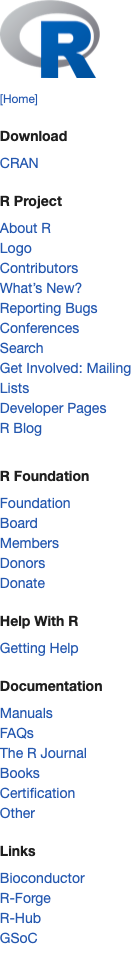

<!-- README.md is generated from README.Rmd. Please edit that file -->
<!-- Do not run R chunks that print any session information.
     This produces unstable output.
     Instead, copy output from a local execution
     Still use README.Rmd to get special UTF-8 chars from pandoc -->

# Chromote: Headless Chrome Remote Interface

<!-- badges: start -->

[](https://github.com/rstudio/chromote/actions)
[](https://CRAN.R-project.org/package=chromote)
[](https://lifecycle.r-lib.org/articles/stages.html#experimental)
<!-- badges: end -->

Chromote is an R implementation of the [Chrome DevTools
Protocol](https://chromedevtools.github.io/devtools-protocol/). It works
with Chrome, Chromium, Opera, Vivaldi, and other browsers based on
[Chromium](https://www.chromium.org/). By default it uses Google Chrome
(which must already be installed on the system). To use a different
browser, see [Specifying which browser to
use](#specifying-which-browser-to-use).

Chromote is not the only R package that implements the Chrome DevTools
Protocol. Here are some others:

- [crrri](https://github.com/RLesur/crrri) by Romain Lesur and
  Christophe Dervieux
- [decapitated](https://github.com/hrbrmstr/decapitated/) by Bob Rudis
- [chradle](https://github.com/milesmcbain/chradle) by Miles McBain

The interface to Chromote is similar to
[chrome-remote-interface](https://github.com/cyrus-and/chrome-remote-interface)
for node.js.

## Installation

``` r
# CRAN
install.packages("chromote")

# Development
remotes::install_github("rstudio/chromote")
```

## Basic usage

This will start a headless browser and open an interactive viewer for it
in a normal browser, so that you can see what the headless browser is
doing.

``` r
library(chromote)

b <- ChromoteSession$new()

# In a web browser, open a viewer for the headless browser. Works best with
# Chromium-based browsers.
b$view()
```

The browser can be given *commands*, as specified by the [Chrome
DevTools Protocol](https://chromedevtools.github.io/devtools-protocol/).
For example, `$Browser$getVersion()` (which corresponds to the
[Browser.getVersion](https://chromedevtools.github.io/devtools-protocol/tot/Browser/#method-getVersion)
in the API docs) will query the browser for version information:

``` r
b$Browser$getVersion()
#> $protocolVersion
#> [1] "1.3"
#>
#> $product
#> [1] "HeadlessChrome/98.0.4758.102"
#>
#> $revision
#> [1] "@273bf7ac8c909cde36982d27f66f3c70846a3718"
#>
#> $userAgent
#> [1] "Mozilla/5.0 (X11; Linux x86_64) AppleWebKit/537.36 (KHTML, like Gecko) HeadlessChrome/98.0.4758.102 Safari/537.36"
#>
#> $jsVersion
#> [1] "9.8.177.11"
```

If you have the viewer open and run the following, you’ll see the web
page load in the viewer:

``` r
b$Page$navigate("https://www.r-project.org/")
```

In the official Chrome DevTools Protocol (CDP) documentation, this is
the
[`Page.navigate`](https://chromedevtools.github.io/devtools-protocol/tot/Page/#method-navigate)
command.

In addition to full support of the CDP, `ChromoteSession` objects also
some convenience methods, like `$screenshot()`. (See the Examples
section below for more information about screenshots.)

``` r
# Saves to screenshot.png
b$screenshot()

# Takes a screenshot of elements picked out by CSS selector
b$screenshot("sidebar.png", selector = ".sidebar")
```



**Note:** All members of `Chromote` and `ChromoteSession` objects which
start with a capital letter (like `b$Page`, `b$DOM`, and `b$Browser`)
correspond to domains from the Chrome DevTools Protocol, and are
documented in the [official CDP
site](https://chromedevtools.github.io/devtools-protocol/). All members
which start with a lower-case letter (like `b$screenshot` and `b$close`)
are not part of the Chrome DevTools Protocol, and are specific to
`Chromote` and `ChromoteSession`.

Here is an example of how to use Chromote to find the position of a DOM
element using
[DOM.getBoxModel](https://chromedevtools.github.io/devtools-protocol/tot/DOM/#method-getBoxModel).

``` r
x <- b$DOM$getDocument()
x <- b$DOM$querySelector(x$root$nodeId, ".sidebar")
x <- b$DOM$getBoxModel(x$nodeId)
str(x)
#> List of 1
#>  $ model:List of 6
#>   ..$ content:List of 8
#>   .. ..$ : num 128
#>   .. ..$ : int 28
#>   .. ..$ : num 292
#>   .. ..$ : int 28
#>   .. ..$ : num 292
#>   .. ..$ : num 988
#>   .. ..$ : num 128
#>   .. ..$ : num 988
#>   ..$ padding:List of 8
#>   .. ..$ : num 112
#>   .. ..$ : int 28
#>   .. ..$ : num 308
#>   .. ..$ : int 28
#>   .. ..$ : num 308
#>   .. ..$ : num 988
#>   .. ..$ : num 112
#>   .. ..$ : num 988
#>   ..$ border :List of 8
#>   .. ..$ : num 112
#>   .. ..$ : int 28
#>   .. ..$ : num 308
#>   .. ..$ : int 28
#>   .. ..$ : num 308
#>   .. ..$ : num 988
#>   .. ..$ : num 112
#>   .. ..$ : num 988
#>   ..$ margin :List of 8
#>   .. ..$ : int 15
#>   .. ..$ : int 28
#>   .. ..$ : num 308
#>   .. ..$ : int 28
#>   .. ..$ : num 308
#>   .. ..$ : num 1030
#>   .. ..$ : int 15
#>   .. ..$ : num 1030
#>   ..$ width  : int 195
#>   ..$ height : int 960
```

Or you can do the same thing by chaining commands together with a
magrittr pipe:

``` r
b$DOM$getDocument() %>%
  { b$DOM$querySelector(.$root$nodeId, ".sidebar") } %>%
  { b$DOM$getBoxModel(.$nodeId) } %>%
  str()
#> List of 1
#>  $ model:List of 6
#>   ..$ content:List of 8
#>   .. ..$ : num 128
#>   .. ..$ : int 28
#>   .. ..$ : num 292
#>   .. ..$ : int 28
#>   .. ..$ : num 292
#>   .. ..$ : num 988
#>   .. ..$ : num 128
#>   .. ..$ : num 988
#>   ..$ padding:List of 8
#>   .. ..$ : num 112
#>   .. ..$ : int 28
#>   .. ..$ : num 308
#>   .. ..$ : int 28
#>   .. ..$ : num 308
#>   .. ..$ : num 988
#>   .. ..$ : num 112
#>   .. ..$ : num 988
#>   ..$ border :List of 8
#>   .. ..$ : num 112
#>   .. ..$ : int 28
#>   .. ..$ : num 308
#>   .. ..$ : int 28
#>   .. ..$ : num 308
#>   .. ..$ : num 988
#>   .. ..$ : num 112
#>   .. ..$ : num 988
#>   ..$ margin :List of 8
#>   .. ..$ : int 15
#>   .. ..$ : int 28
#>   .. ..$ : num 308
#>   .. ..$ : int 28
#>   .. ..$ : num 308
#>   .. ..$ : num 1030
#>   .. ..$ : int 15
#>   .. ..$ : num 1030
#>   ..$ width  : int 195
#>   ..$ height : int 960
```

### Creating new tabs and managing the process

To create a new tab/window:

``` r
b1 <- b$new_session()
```

Once it’s created, you can perform operations with the new tab without
affecting the first one.

``` r
b1$view()
b1$Page$navigate("https://github.com/rstudio/chromote")
#> $frameId
#> [1] "714439EBDD663E597658503C86F77B0B"
#>
#> $loaderId
#> [1] "F39339CBA7D1ACB83618FEF40C3C7467"
```

To close a browser tab/window, you can run:

``` r
b1$close()
```

This is different from shutting down the browser process. If you call
`b$close()`, the browser process will still be running, even if all tabs
have been closed. If all tabs have been closed, you can still create a
new tab by calling `b1$new_session()`.

To shut down the process, call:

``` r
b1$parent$close()
```

`b1$parent` is a `Chromote` object (as opposed to `ChromoteSession`),
which represents the browser as a whole. This is explained in [The
Chromote object model](#the-chromote-object-model).

### Commands and Events

The Chrome DevTools Protocol has two types of methods: *commands* and
*events*. The methods used in the previous examples are commands. That
is, they tell the browser to do something; the browser does it, and then
sends back some data.

Events are quite different from commands. When, for example, you run
`b$Page$loadEventFired()`, it does not send a message to the browser.
Rather, this method tells the R process to wait until it receives a
`Page.loadEventFired` message from the browser.

Here is an example of how that event can be used. Note that these two
lines of code must be run together, without any delay at all (this can
be enforced by wrapping both lines of code in `{ .... }`).

``` r
# Send a command to navigate to a page
b$Page$navigate("https://www.r-project.org")
#> $frameId
#> [1] "0ADE3CFBAF764B0308ADE1ACCC33358B"
#>
#> $loaderId
#> [1] "112AF4AC0C13FF4A95BED8173C3F4C7F"

# Wait for the Page.loadEventFired event
b$Page$loadEventFired()
#> $timestamp
#> [1] 680.7603
```

After running these two lines, the R process will be blocked. While it’s
blocked, the browser will load the page, and then send a message to the
R process saying that the `Page.loadEventFired` event has occurred. The
message looks something like this:

``` json
{"method":"Page.loadEventFired","params":{"timestamp":699232.345338}}
```

After the R process receives this message, the function returns the
value, which looks like this:

    $timestamp
    [1] 699232.3

> **Technical note:** Chromote insulates the user from some of the
> details of how the CDP implements event notifications. Event
> notifications are not sent from the browser to the R process by
> default; you must first send a command to enable event notifications
> for a domain. For example `Page.enable` enables event notifications
> for the `Page` domain – the browser will send messages for *all*
> `Page` events. (See the Events section in [this
> page](https://chromedevtools.github.io/devtools-protocol/tot/Page/)).
> These notifications will continue to be sent until the browser
> receives a `Page.disable` command.
>
> By default, Chromote hides this implementation detail. When you call
> `b$Page$loadEventFired()`, Chromote sends a `Page.enable` command
> automatically, and then waits until it receives the
> `Page.loadEventFired` event notification. Then it sends a
> `Page.disable` command.
>
> Note that in asynchronous mode, the behavior is slightly more
> sophisticated: it maintains a counter of how many outstanding events
> it is waiting for in a given domain. When that count goes from 0 to 1,
> it sends the `X.enable` command; when the count goes from 1 to 0, it
> sends the `X.disable` command. For more information, see the [Async
> events](#async-events) section.
>
> If you do not want automatic event enabling and disabling, then when
> creating the ChromoteSession object, use
> `ChromoteSession$new(auto_events = FALSE)`.

### The Chromote object model

There are two R6 classes that are used to represent the Chrome browser.
One is `Chromote`, and the other is `ChromoteSession`. A `Chromote`
object represents the browser as a whole, and it can have multiple
*targets*, which each represent a browser tab. In the Chrome DevTools
Protocol, each target can have one or more debugging *sessions* to
control it. A `ChromoteSession` object represents a single *session*.

When a `ChromoteSession` object is instantiated, a target is created,
then a session is attached to that target, and the `ChromoteSession`
object represents the session. (It is possible, though not very useful,
to have multiple `ChromoteSession` objects connected to the same target,
each with a different session.)

A `Chromote` object can have any number of `ChromoteSession` objects as
children. It is not necessary to create a `Chromote` object manually.
You can simply call:

``` r
b <- ChromoteSession$new()
```

and it will automatically create a `Chromote` object if one has not
already been created. The Chromote package will then designate that
`Chromote` object as the *default* Chromote object for the package, so
that any future calls to `ChromoteSession$new()` will automatically use
the same `Chromote`. This is so that it doesn’t start a new browser for
every `ChromoteSession` object that is created.

In the Chrome DevTools Protocol, most commands can be sent to individual
sessions using the `ChromoteSession` object, but there are some commands
which can only be sent to the overall browser, using the `Chromote`
object.

To access the parent `Chromote` object from a `ChromoteSession`, you can
simply use `$parent`:

``` r
b <- ChromoteSession$new()
m <- b$parent
```

With a `Chromote` object, you can get a list containing all the
`ChromoteSession`s, with `$get_sessions()`:

``` r
m$get_sessions()
```

Normally, subsequent calls to `ChromoteSession$new()` will use the
existing `Chromote` object. However, if you want to start a new browser
process, you can manually create a `Chromote` object, then spawn a
session from it; or you can pass the new `Chromote` object to
`ChromoteSession$new()`:

``` r
cm <- Chromote$new()
b1 <- cm$new_session()

# Or:
b1 <- ChromoteSession$new(parent = cm)
```

Note that if you use either of these methods, the new `Chromote` object
will *not* be set as the default that is used by future calls to
`ChromoteSesssion$new()`. See [Specifying which browser to
use](#specifying-which-browser-to-use) for information on setting the
default `Chromote` object.

There are also the following classes which represent the browser at a
lower level:

- `Browser`: This represents an instance of a browser that supports the
  Chrome DevTools Protocol. It contains information about how to
  communicate with the Chrome browser. A `Chromote` object contains one
  of these.
- `Chrome`: This is a subclass of `Browser` that represents a local
  browser. It extends the `Browser` class with a `processx::process`
  object, which represents the browser’s system process.
- `ChromeRemote`: This is a subclass of `Browser` that represents a
  browser running on a remote system.

### Debugging

Calling `b$debug_messages(TRUE)` will enable the printing of all the
JSON messages sent between R and Chrome. This can be very helpful for
understanding how the Chrome DevTools Protocol works.

``` r
b <- ChromoteSession$new()
b$parent$debug_messages(TRUE)
b$Page$navigate("https://www.r-project.org/")
#> SEND {"method":"Page.navigate","params":{"url":"https://www.r-project.org/"},"id":53,"sessionId":"12CB6B044A379DA0BDCFBBA55318247C"}
#> $frameId
#> [1] "BAAC175C67E55886207BADE1776E7B1F"
#>
#> $loaderId
#> [1] "66DED3DF9403DA4A307444765FDE828E"

# Disable debug messages
b$parent$debug_messages(FALSE)
```

### Synchronous vs. asynchronous usage

By default, when you call methods from a `Chromote` or `ChromoteSession`
object, it operates in *synchronous* mode. For example, when you call a
command function (like `b$Page$navigate()`), a command message is sent
to the headless browser, the headless browser executes that command, and
it sends a response message back. When the R process receives the
response, it converts it from JSON to an R object and the function
returns that value. During this time, the R process is blocked; no other
R code can execute.

The methods in Chromote/ChromoteSession objects can also be called in
*asynchronous* mode. In async mode, a command function fires off a
message to the browser, and then the R process continues running other
code; when the response comes back at some time in the future, the R
process calls another function and passes the response value to it.

There are two different ways of using async with Chromote. The first is
with [promises](https://rstudio.github.io/promises/) (note that these
are not the regular R-language promises; these are similar to JavaScript
promises for async programming.) The second way is with callbacks: you
call methods with a `callback_` argument. Although callbacks are
initially easier to use than promises, once you start writing more
complex code, managing callbacks becomes very difficult, especially when
error handling is involved. For this reason, this document will focus
mostly on promises instead of callback-style programming.

When Chromote methods are called in synchronous mode, under the hood,
they are implemented with asynchronous functions, and then waiting for
the asynchronous functions to resolve.

> **Technical note about the event loop**: When methods are called
> asynchronously, the R process will run callbacks and promises using an
> event loop provided by the [later](https://github.com/r-lib/later)
> package. This event loop is very similar to the one used in
> JavaScript, which is explained in depth by [Philip Roberts in this
> video](https://youtu.be/8aGhZQkoFbQ). One important difference between
> JavaScript’s event loop and the one provided by **later**’s is that in
> JavaScript, the event loop only runs when the call stack is empty
> (essentially, when the JS runtime is idle); with **later** the event
> loop similarly runs when the call stack is empty (when the R console
> is idle), but it can also be run at any point by calling
> `later::run_now()`.
>
> There is another important difference between the JS event loop and
> the one used by Chromote: Chromote uses *private event loops* provided
> by [later](https://github.com/r-lib/later). Running the private event
> loop with `run_now()` will not interfere with the global event loop.
> This is crucial for being able to run asynchronous code in a way that
> appears synchronous.

#### Why async?

The synchronous API is easier to use than the asynchronous one. So why
would you want to use the async API? Here are some reasons:

- The async API allows you to send commands to the browser that may take
  some time for the browser to complete, and they will not block the R
  process from doing other work while the browser executes the command.
- The async API lets you send commands to multiple browser “tabs” and
  let them work in parallel.

On the other hand, async programming can make it difficult to write code
that proceeds in a straightforward, linear manner. Async programming may
be difficult to use in, say, an analysis script.

When using Chromote interactively at the R console, it’s usually best to
just call methods synchronously. This fits well with a iterative,
interactive data analysis workflow.

When you are *programming* with Chromote instead of using it
interactively, it is in many cases better to call the methods
asynchronously, because it allows for better performance. In a later
section, we’ll see how to write asynchronous code with Chromote that can
be run either synchronously or asynchronously. This provides the best of
both worlds.

#### Async commands

When a method is called in synchronous mode, it blocks until the browser
sends back a response, and then it returns the value, converted from
JSON to an R object. For example:

``` r
# Synchronous
str(b$Browser$getVersion())
#> List of 5
#>  $ protocolVersion: chr "1.3"
#>  $ product        : chr "HeadlessChrome/98.0.4758.102"
#>  $ revision       : chr "@273bf7ac8c909cde36982d27f66f3c70846a3718"
#>  $ userAgent      : chr "Mozilla/5.0 (X11; Linux x86_64) AppleWebKit/537.36 (KHTML, like Gecko) HeadlessChrome/98.0.4758.102 Safari/537.36"
#>  $ jsVersion      : chr "9.8.177.11"
```

In async mode, there are two ways to use the value that the browser
sends to the R process. One is to use the `callback_` argument with
`wait_=FALSE`. The `wait_=FALSE` tells it to run the command in async
mode; instead of returning the value from the browser, it returns a
promise. For example:

``` r
# Async with callback
b$Browser$getVersion(wait_ = FALSE, callback_ = str)
#> <Promise [pending]>
#> List of 5
#>  $ protocolVersion: chr "1.3"
#>  $ product        : chr "HeadlessChrome/98.0.4758.102"
#>  $ revision       : chr "@273bf7ac8c909cde36982d27f66f3c70846a3718"
#>  $ userAgent      : chr "Mozilla/5.0 (X11; Linux x86_64) AppleWebKit/537.36 (KHTML, like Gecko) HeadlessChrome/98.0.4758.102 Safari/537.36"
#>  $ jsVersion      : chr "9.8.177.11"
```

Notice that the function returned `<Promise [pending]>`, and then it
printed out the data. We’ll come back to the promise part.

> **Technical note:** When you pass a function as `callback_`, that
> function is used as the first step in the promise chain that is
> returned.

If you run the command in a code block (or a function), the entire code
block will finish executing before the callback can be executed. For
example:

``` r
{
  b$Browser$getVersion(wait_ = FALSE, callback_ = str)
  1+1
}
#> [1] 2
#> List of 5
#>  $ protocolVersion: chr "1.3"
#>  $ product        : chr "HeadlessChrome/98.0.4758.102"
#>  $ revision       : chr "@273bf7ac8c909cde36982d27f66f3c70846a3718"
#>  $ userAgent      : chr "Mozilla/5.0 (X11; Linux x86_64) AppleWebKit/537.36 (KHTML, like Gecko) HeadlessChrome/98.0.4758.102 Safari/537.36"
#>  $ jsVersion      : chr "9.8.177.11"
```

In the code above, it executes the `1+1` and returns the value before
the `str` callback can be executed on the message from the browser.

If you want to store the value from the browser, you can write a
callback that stores the value like so:

``` r
# This will extract the product field
product <- NULL
b$Browser$getVersion(wait_ = FALSE, callback_ = function(msg) {
  product <<- msg$product
})
#> <Promise [pending]>
# Wait for a moment, then run:
product
#> [1] "HeadlessChrome/98.0.4758.102"
```

But to get the value, you need to wait for the callback to execute
before you can use the value. Waiting for a value is simple when running
R interactively – you can just add a `message("message arrived")` call
in the callback and wait for it before running the next line of code –
but waiting for the value is not easy to do using ordinary straight-line
coding. Fortunately, Chromote has a way to wait for async operations,
which we’ll see later.

The other way of using the value is to use *promises*. If `wait_=FALSE`
and no `callback_` is passed to the command, then it will simply return
a promise. Promises have many advantages over plain old callbacks: they
are easier to chain, and they provide better error-handling
capabilities. You can *chain* more steps to the promise: when the
promise resolves – that is, when the message is received from the
browser – it will run the next step in the promise chain.

Here’s an example that uses promises to print out the version
information. Note that the surrounding curly braces are there to
indicate that this whole thing must be run as a block without any idle
time in between the function calls – if you were to run the code in the
R console line-by-line, the browser would send back the message and the
promise would resolve before you called `p$then()`, which is where you
tell the promise what to do with the return value. (The curly braces
aren’t strictly necessary – you could run the code inside the braces in
a single paste operation and have the same effect.)

``` r
{
  p <- b$Browser$getVersion(wait_ = FALSE)
  p$then(function(value) {
    print(value$product)
  })
}
# Wait for a moment, then prints:
#> [1] "HeadlessChrome/98.0.4758.102"
```

Here are some progressively more concise ways of achieving the same
thing. As you work with promises, you will see these various forms of
promise chaining. For more information, see the [promises
documentation](https://rstudio.github.io/promises/).

``` r
library(promises)

# Regular function pipe to then()
b$Browser$getVersion(wait_ = FALSE) %>% then(function(value) {
  print(value$product)
})

# Promise-pipe to anonymous function, which must be wrapped in parens
b$Browser$getVersion(wait_ = FALSE) %...>% (function(value) {
  print(value$product)
})

# Promise-pipe to an expression (which gets converted to a function with the first argument `.`)
b$Browser$getVersion(wait_ = FALSE) %...>% { print(.$product) }

# Promise-pipe to a named function, with parentheses
print_product <- function(msg) print(msg$product)
b$Browser$getVersion(wait_ = FALSE) %...>% print_product()

# Promise-pipe to a named function, without parentheses
b$Browser$getVersion(wait_ = FALSE) %...>% print_product
```

The earlier example where we found the dimensions of a DOM element using
CSS selectors was done with the synchronous API and `%>%` pipes. The
same can be done in async mode by switching from the regular pipe to the
promise-pipe, and calling all the methods with `wait_=FALSE`:

``` r
b$DOM$getDocument(wait_ = FALSE) %...>%
  { b$DOM$querySelector(.$root$nodeId, ".sidebar", wait_ = FALSE) } %...>%
  { b$DOM$getBoxModel(.$nodeId, wait_ = FALSE) } %...>%
  str()


# Or, more verbosely:
b$DOM$getDocument(wait_ = FALSE)$
  then(function(value) {
    b$DOM$querySelector(value$root$nodeId, ".sidebar", wait_ = FALSE)
  })$
  then(function(value) {
    b$DOM$getBoxModel(value$nodeId, wait_ = FALSE)
  })$
  then(function(value) {
    str(value)
  })
```

Each step in the promise chain uses the value from the previous step,
via `.` or `value`. Note that not all asynchronous code works in such a
linear, straightforward way. Sometimes it is necessary to save data from
intermediate steps in a broader-scoped variable, if it is to be used in
a later step in the promise chain.

#### Turning asynchronous code into synchronous code

There may be times, especially when programming with Chromote, where you
want to wait for a promise to resolve before continuing. To do this, you
can use the Chromote or ChromoteSession’s `wait_for()` method.

``` r
# A promise chain
p <- b$DOM$getDocument(wait_ = FALSE) %...>%
  { b$DOM$querySelector(.$root$nodeId, ".sidebar", wait_ = FALSE) } %...>%
  { b$DOM$getBoxModel(.$nodeId, wait_ = FALSE) } %...>%
  str()

b$wait_for(p)
#> List of 1
#>  $ model:List of 6
#>   ..$ content:List of 8
#>   .. ..$ : num 128
#>   .. ..$ : int 28
#>   .. ..$ : num 292
#>   .. ..$ : int 28
#>   .. ..$ : num 292
#>   .. ..$ : num 988
#>   .. ..$ : num 128
#>   .. ..$ : num 988
#>   ..$ padding:List of 8
#>   .. ..$ : num 112
#>   .. ..$ : int 28
#>   .. ..$ : num 308
#>   .. ..$ : int 28
#>   .. ..$ : num 308
#>   .. ..$ : num 988
#>   .. ..$ : num 112
#>   .. ..$ : num 988
#>   ..$ border :List of 8
#>   .. ..$ : num 112
#>   .. ..$ : int 28
#>   .. ..$ : num 308
#>   .. ..$ : int 28
#>   .. ..$ : num 308
#>   .. ..$ : num 988
#>   .. ..$ : num 112
#>   .. ..$ : num 988
#>   ..$ margin :List of 8
#>   .. ..$ : int 15
#>   .. ..$ : int 28
#>   .. ..$ : num 308
#>   .. ..$ : int 28
#>   .. ..$ : num 308
#>   .. ..$ : num 1030
#>   .. ..$ : int 15
#>   .. ..$ : num 1030
#>   ..$ width  : int 195
#>   ..$ height : int 960
```

This documentation will refer to this technique as *synchronizing*
asynchronous code. The way that `wait_for()` works is that it runs the
Chromote object’s private event loop until the promise has resolved.
Because the event loop is *private*, running it will not interfere with
the global event loop, which, for example, may used by Shiny to serve a
web application.

The `$wait_for()` method will return the value from the promise, so
instead of putting the `str()` in the chain, you call `str()` on the
value returned by `$wait_for()`:

``` r
p <- b$DOM$getDocument(wait_ = FALSE) %...>%
  { b$DOM$querySelector(.$root$nodeId, ".sidebar", wait_ = FALSE) } %...>%
  { b$DOM$getBoxModel(.$nodeId, wait_ = FALSE) }

x <- b$wait_for(p)
str(x)
#> List of 1
#>  $ model:List of 6
#>   ..$ content:List of 8
#>   .. ..$ : num 128
#>   .. ..$ : int 28
#>   .. ..$ : num 292
#>   .. ..$ : int 28
#>   .. ..$ : num 292
#>   .. ..$ : num 988
#>   .. ..$ : num 128
#>   .. ..$ : num 988
#>   ..$ padding:List of 8
#>   .. ..$ : num 112
#>   .. ..$ : int 28
#>   .. ..$ : num 308
#>   .. ..$ : int 28
#>   .. ..$ : num 308
#>   .. ..$ : num 988
#>   .. ..$ : num 112
#>   .. ..$ : num 988
#>   ..$ border :List of 8
#>   .. ..$ : num 112
#>   .. ..$ : int 28
#>   .. ..$ : num 308
#>   .. ..$ : int 28
#>   .. ..$ : num 308
#>   .. ..$ : num 988
#>   .. ..$ : num 112
#>   .. ..$ : num 988
#>   ..$ margin :List of 8
#>   .. ..$ : int 15
#>   .. ..$ : int 28
#>   .. ..$ : num 308
#>   .. ..$ : int 28
#>   .. ..$ : num 308
#>   .. ..$ : num 1030
#>   .. ..$ : int 15
#>   .. ..$ : num 1030
#>   ..$ width  : int 195
#>   ..$ height : int 960
```

There are some methods in Chromote and ChromoteSession objects which are
written using asynchronous method calls, but conditionally use
`wait_for()` so that they can be called either synchronously or
asynchronously. The `$screenshot()` method works this way, for example.
You can call `b$screenshot(wait_=TRUE)` (which is the default) for
synchronous behavior, or `b$screenshot(wait_=FALSE)` for async behavior.

If you want to write a function that can be called in either sync or
async mode, you can use this basic structure: First, construct a promise
chain by calling the CDP methods with `wait_=FALSE`. Then, at the end,
if the user used `wait_=TRUE`, wait for the promise to resolve;
otherwise, simply return the promise.

``` r
getBoxModel <- function(b, selector = "html", wait_ = TRUE) {
  p <- b$DOM$getDocument(wait_ = FALSE) %...>%
    { b$DOM$querySelector(.$root$nodeId, selector, wait_ = FALSE) } %...>%
    { b$DOM$getBoxModel(.$nodeId, wait_ = FALSE) }

  if (wait_) {
    b$wait_for(p)
  } else {
    p
  }
}

# Synchronous call
str(getBoxModel(b, ".sidebar"))

# Asynchronous call
getBoxModel(b, ".sidebar", wait_ = FALSE) %...>%
  str()
```

But, you might be wondering, if we want a synchronous API, why not
simply write the synchronous code by calling the individual methods
synchronously, and using a normal pipe to connect them, as in:

``` r
b$DOM$getDocument() %>%
  { b$DOM$querySelector(.$root$nodeId, ".sidebar") } %>%
  { b$DOM$getBoxModel(.$nodeId) } %>%
  str()
```

There are two reasons for this. The first is that this would require a
duplication of all the code for the sync and async code paths. Another
reason is that the internal async code can be written to send multiple
independent command chains to the ChromoteSession (or multiple
ChromoteSessions), and they will be executed concurrently. If there are
multiple promise chains, you can do something like the following to wait
for all of them to resolve:

``` r
# Starting with promises p1, p2, and p3, create a promise that resolves only
# after they have all been resolved.
p <- promise_all(p1, p2, p3)
b$wait_for(p)
```

## Async events

In addition to *commands* The Chrome DevTools Protocol also has
*events*. These are messages that are sent from the browser to the R
process when various browser events happen.

As an example, it can be a bit tricky to find out when to take a
screenshot. When you send the browser a command to navigate to a page,
it sends a response immediately, but it may take several more seconds
for it to actually finish loading that page. When it does, the
`Page.loadEventFired` event will be fired.

``` r
b <- ChromoteSession$new()

# Navigate and wait for Page.loadEventFired.
# Note: these lines are put in a single code block to ensure that there is no
# idle time in between.
{
  b$Page$navigate("https://www.r-project.org/")
  str(b$Page$loadEventFired())
}
#> List of 1
#>  $ timestamp: num 683
```

With the synchronous API, the call to `b$Page$loadEventFired()` will
block until Chromote receives a `Page.loadEventFired` message from the
browser. However, with the async promise API, you would write it like
this:

``` r
b$Page$navigate("https://www.r-project.org/", wait_ = FALSE) %...>%
  { b$Page$loadEventFired(wait_ = FALSE) } %...>%
  { str(.) }

# Or, more verbosely:
b$Page$navigate("https://www.r-project.org/", wait_ = FALSE)$
  then(function(value) {
    b$Page$loadEventFired(wait_ = FALSE)
  })$
  then(function(value) {
    str(value)
  })
```

There will be a short delay after running the code before the value is
printed.

If you want to schedule a chain of promises and then wait for them to
resolve, you can once again use the `wait_for()` method. For example:

``` r
p <- b$Page$navigate("https://www.r-project.org/", wait_ = FALSE)$
  then(function(value) {
    b$Page$loadEventFired(wait_ = FALSE)
  })

# wait_for returns the last value in the chain, so we can call str() on it
str(b$wait_for(p))
#> List of 1
#>  $ timestamp: num 683
```

This particular example has a twist to it: After sending the
`Page.navigate` command, the R process doesn’t really need to wait for
browser’s response before it starts waiting for the
`Page.loadEventFired` event. So instead of chaining, you could just do
this:

``` r
p <- promise(function(resolve, reject) {
  b$Page$navigate("https://www.r-project.org/", wait_ = FALSE)
  resolve(b$Page$loadEventFired(wait_ = FALSE))
})

str(b$wait_for(p))
#> List of 1
#>  $ timestamp: num 683
```

Essentially, the `Page.navigate` command gets sent off and we don’t need
to wait for the browser’s reply. We can tell R to immediately start
waiting for the `Page.loadEventFired` event.

We can simplify it by not wrapping both method calls in a promise. We
can just fire off the navigation command, and then directly use the
promise that’s returned by the event method:

``` r
b$Page$navigate("https://www.r-project.org/", wait_ = FALSE)
p <- b$Page$loadEventFired(wait_ = FALSE)
str(b$wait_for(p))
#> List of 1
#>  $ timestamp: num 683
```

And we can make it yet simpler by firing off the navigation command and
then calling `b$Page$loadEventFired()` in synchronous mode (with the
default `wait_=TRUE`), which already calls `wait_for()`.

``` r
b$Page$navigate("https://www.r-project.org/", wait_ = FALSE)
x <- b$Page$loadEventFired()
str(x)
#> List of 1
#>  $ timestamp: num 683
```

> **Technical note:** The Chrome DevTools Protocol itself does not
> automatically enable event notifications. Normally, you would have to
> call the `Page.enable` method to turn on event notifications for the
> Page domain. However, Chromote saves you from needing to do this step
> by keeping track of how many callbacks there are for each domain. When
> the number of event callbacks for a domain goes from 0 to 1, Chromote
> automatically calls `$enable()` for that domain, and when it goes from
> 1 to 0, it it calls `$disable()`.

In addition to async events with promises, they can also be used with
regular callbacks. For example:

``` r
b$Page$loadEventFired(callback_ = str)
```

This tells Chromote to call `str()` (which prints to the console) on the
message value every single time that a `Page.loadEventFired` event
message is received. It will continue doing this indefinitely. (Calling
an event method this way also increments the event callback counter.)

When an event method is called with a callback, the return value is a
function which will cancel the callback, so that it will no longer fire.
(The canceller function also decrements the event callback counter. If
you lose the canceller function, there is no way to decrement the
callback counter back to 0.)

``` r
cancel_load_event_callback <- b$Page$loadEventFired(callback_ = str)

# Each of these will cause the callback to fire.
n1 <- b$Page$navigate("https://www.r-project.org/")
n2 <- b$Page$navigate("https://cran.r-project.org/")

cancel_load_event_callback()

# No longer causes the callback to fire.
n3 <- b$Page$navigate("https://www.rstudio.com/")
```

## Resource cleanup and garbage collection

When Chromote starts a Chrome process, it calls `Chrome$new()`. This
launches the Chrome process it using `processx::process()`, and enables
a supervisor for the process. This means that if the R process stops,
the supervisor will detect this and shut down any Chrome processes that
were registered with the supervisor. This prevents the proliferation of
Chrome processes that are no longer needed.

The Chromote package will, by default, use a single Chrome process and a
single `Chromote` object, and each time `ChromoteSession$new()` is
called, it will spawn them from the `Chromote` object. See [The Chromote
object model](#the-chromote-object-model) for more information.

## Specifying which browser to use

Chromote will look in specific places for the Chrome web browser,
depending on platform. This is done by the `chromote:::find_chrome()`
function.

If you wish to use a different browser from the default, you can set the
`CHROMOTE_CHROME` environment variable, either with
`Sys.setenv(CHROMOTE_CHROME="/path/to/browser")`.

``` r
Sys.setenv(CHROMOTE_CHROME = "/Applications/Chromium.app/Contents/MacOS/Chromium")

b <- ChromoteSession$new()
b$view()
b$Page$navigate("https://www.whatismybrowser.com/")
```

Another way is create a `Chromote` object and explicitly specify the
browser, then spawn `ChromoteSession`s from it.

``` r
m <- Chromote$new(
  browser = Chrome$new(path = "/Applications/Chromium.app/Contents/MacOS/Chromium")
)

# Spawn a ChromoteSession from the Chromote object
b <- m$new_session()
b$Page$navigate("https://www.whatismybrowser.com/")
```

Yet another way is to create a `Chromote` object with a specified
browser, then set it as the default Chromote object.

``` r
m <- Chromote$new(
  browser = Chrome$new(path = "/Applications/Chromium.app/Contents/MacOS/Chromium")
)

# Set this Chromote object as the default. Then any
# ChromoteSession$new() will be spawned from it.
set_default_chromote_object(m)
b <- ChromoteSession$new()
b$view()
b$Page$navigate("https://www.whatismybrowser.com/")
```

## Chrome on remote hosts

Chromote can control a browser running on a remote host. To start the
browser, open a terminal on the remote host and run one of the
following, depending on your platform:

**Warning: Depending on how the remote machine is configured, the Chrome
debug server might be accessible to anyone on the Internet. Proceed with
caution.**

    # Mac
    "/Applications/Google Chrome.app/Contents/MacOS/Google Chrome" --headless \
      --remote-debugging-address=0.0.0.0 --remote-debugging-port=9222

    # Linux
    google-chrome --headless --remote-debugging-address=0.0.0.0 --remote-debugging-port=9222

    # Windows
    "C:\Program Files (x86)\Google\Chrome\Application\chrome.exe"  --headless \
      --remote-debugging-address=0.0.0.0 --remote-debugging-port=9222

Then, in your local R session, create a Chromote object with the `host`
and `port` (you will need to use the correct IP address). Once it’s
created, you can spawn a session off of it which you can control as
normal:

``` r
r <- Chromote$new(
  browser = ChromeRemote$new(host = "10.0.0.5", port = 9222)
)

b <- r$new_session()

b$Browser$getVersion()
b$view()
b$Page$navigate("https://www.whatismybrowser.com/")
b$Page$loadEventFired()
b$screenshot("browser.png")
b$screenshot("browser_string.png", selector = ".string-major")
```

When you use `$view()` on the remote browser, your local browser may
block scripts for security reasons, which means that you won’t be able
to view the remote browser. If your local browser is Chrome, there will
be a shield-shaped icon in the location bar that you can click in order
to enable loading the scripts. (Note: Some browsers don’t seem to work
at all with the viewer.)

**Technical note:** There seem to be some timing issues with remote
browsers. In the example above, the browser may finish navigating to the
web site before the R process receives the response message for
`$navigate()`, and therefore before R starts waiting for
`Page.loadEventFired`. In order to avoid these timing problems, it may
be better to write code like this:

``` r
{
  b$Page$navigate("https://www.whatismybrowser.com/", wait_ = FALSE)
  b$Page$loadEventFired()
}
b$screenshot("browser.png")
```

This tells it to fire off the `Page.navigate` command and *not* wait for
it, and then immediately start waiting for `Page.loadEventFired` event.

### Attaching to existing tabs

In the examples above, we connected to an existing browser, but created
a new tab to attach to. It’s also possible to attach to an existing
browser *and* and existing tab. In Chrome debugging terminology a tab is
called a “Target”, and there is a command to retrieve the list of
current Targets:

``` r
r$Target$getTargets()
```

Every target has a unique identifier string associated with it called
the `targetId`; `"9DAE349A3A533718ED9E17441BA5159B"` is an example of
one.

Here we define a function that retrieves the ID of the first Target
(tab) from a Chromote object:

``` r
first_id <- function(r) {
  ts <- r$Target$getTargets()$targetInfos
  stopifnot(length(ts) > 0)
  r$Target$getTargets()$targetInfos[[1]]$targetId
}
```

The following code shows an alert box in the first tab, whatever it is:

``` r
rc <- ChromeRemote$new(host = "localhost", port = 9222)
r <- Chromote$new(browser = rc)
tid <- first_id(r)
b <- r$new_session(targetId = tid)
b$Runtime$evaluate('alert("this is the first tab")')
```

------------------------------------------------------------------------

## Examples

### Taking a screenshot of a web page

Take a screenshot of the viewport and display it using the
[showimage](https://github.com/r-lib/showimage#readme) package. This
uses Chromote’s `$screenshot()` method, which wraps up many calls to the
Chrome DevTools Protocol.

``` r
b <- ChromoteSession$new()

# ==== Synchronous version ====
# Run the next two lines together, without any delay in between.
b$Page$navigate("https://www.r-project.org/")
b$Page$loadEventFired()

b$screenshot(show = TRUE)  # Saves to screenshot.png and displays in viewer

# ==== Async version ====
b$Page$navigate("https://www.r-project.org/", wait_ = FALSE)
b$Page$loadEventFired(wait_ = FALSE)$
  then(function(value) {
    b$screenshot(show = TRUE)
  })
```

It is also possible to use selectors to specify what to screenshot, as
well as the region (“content”, “border”, “padding”, or “margin”).

``` r
# Using CSS selectors, choosing the region, and using scaling
b$screenshot("s1.png", selector = ".sidebar")
b$screenshot("s2.png", selector = ".sidebar", region = "margin")
b$screenshot("s3.png", selector = ".page", region = "margin", scale = 2)
```

If a vector is passed to `selector`, it will take a screenshot with a
rectangle that encompasses all the DOM elements picked out by the
selectors. Similarly, if a selector picks out multiple DOM elements, all
of them will be in the screenshot region.

### Taking a screenshot of a web page after interacting with it

Headless Chrome provides a remote debugging UI which you can use to
interact with the web page. The ChromoteSession’s `$view()` method opens
a regular browser and navigates to the remote debugging UI.

``` r
b <- ChromoteSession$new()

b$view()
b$Page$navigate("https://www.google.com") # Or just type the URL in the navigation bar
```

At this point, you can interact with the web page by typing in text and
clicking on things.

Then take a screenshot:

``` r
b$screenshot()
```

### Taking screenshots of web pages in parallel

With async code, it’s possible to navigate to and take screenshots of
multiple websites in parallel.

``` r
library(promises)
library(chromote)
urls <- c(
  "https://www.r-project.org/",
  "https://github.com/",
  "https://news.ycombinator.com/"
)

screenshot_p <- function(url, filename = NULL) {
  if (is.null(filename)) {
    filename <- gsub("^.*://", "", url)
    filename <- gsub("/", "_", filename)
    filename <- gsub("\\.", "_", filename)
    filename <- sub("_$", "", filename)
    filename <- paste0(filename, ".png")
  }

  b <- ChromoteSession$new()
  b$Page$navigate(url, wait_ = FALSE)
  b$Page$loadEventFired(wait_ = FALSE)$
    then(function(value) {
      b$screenshot(filename, wait_ = FALSE)
    })$
    then(function(value) {
      message(filename)
    })$
    finally(function() {
      b$close()
    })
}

# Screenshot multiple simultaneously
ps <- lapply(urls, screenshot_p)
pa <- promise_all(.list = ps)$then(function(value) {
  message("Done!")
})

# Block the console until the screenshots finish (optional)
cm <- default_chromote_object()
cm$wait_for(pa)
#> www_r-project_org.png
#> github_com.png
#> news_ycombinator_com.png
#> Done!
```

### Setting custom headers

Currently setting custom headers requires a little extra work because it
requires `Network.enable` be called before using it. In the future we’ll
streamline things so that it will happen automatically.

``` r
b <- ChromoteSession$new()
# Currently need to manually enable Network domain notifications. Calling
# b$Network$enable() would do it, but calling it directly will bypass the
# callback counting and the notifications could get automatically disabled by a
# different Network event. We'll enable notifications for the Network domain by
# listening for a particular event. We'll also store a callback that will
# decrement the callback counter, so that we can disable notifications ater.
disable_network_notifications <- b$Network$responseReceived(function (msg) NULL)
b$Network$setExtraHTTPHeaders(headers = list(
  foo = "bar",
  header1 = "value1"
))

# Visit a web page that prints out the request headers
b$Page$navigate("http://scooterlabs.com/echo")
b$screenshot(show = TRUE)


# Unset extra headers. Note that `list(a=1)[0]` creates an empty _named_ list;
# an empty unnamed list will cause an error because they're converted to JSON
# differently. A named list becomes "{}", but an unnamed list becomes "[]".
b$Network$setExtraHTTPHeaders(headers = list(a=1)[0])

# Request again
b$Page$navigate("http://scooterlabs.com/echo")
b$screenshot(show = TRUE)


# Disable extra headers entirely, by decrementing Network callback counter,
# which will disable Network notifications.
disable_network_notifications()
```

### Custom User-Agent

Synchronous version:

``` r
# ==== Synchronous version ====
b$Network$setUserAgentOverride(userAgent = "My fake browser")

b$Page$navigate("http://scooterlabs.com/echo")
b$screenshot(show = TRUE)


# ==== Async version ====
b$Network$setUserAgentOverride(userAgent = "My fake browser", wait_ = FALSE)
b$Page$navigate("http://scooterlabs.com/echo", wait_ = FALSE)
b$Page$loadEventFired(wait_ = FALSE)$
  then(function(value) {
    b$screenshot(show = TRUE)
  })
```

### Extracting text from a web page

One way to extract text from a page is to tell the browser to run
JavaScript code that does it:

``` r
# ==== Synchronous version ====
b$Page$navigate("https://www.whatismybrowser.com/")

# Run JavaScript to extract text from the page
x <- b$Runtime$evaluate('document.querySelector(".corset .string-major a").innerText')
x$result$value
#> [1] "Chrome 75 on macOS (Mojave)"


# ==== Async version ====
b$Page$navigate("https://www.whatismybrowser.com/", wait_ = FALSE)
b$Page$loadEventFired(wait_ = FALSE)$
  then(function(value) {
    b$Runtime$evaluate(
      'document.querySelector(".corset .string-major a").innerText'
    )
  })$
  then(function(value) {
    print(value$result$value)
  })
```

Another way is to use CDP commands to extract content from the DOM. This
does not require executing JavaScript in the browser’s context, but it
is also not as flexible as JavaScript.

``` r
# ==== Synchronous version ====
b$Page$navigate("https://www.whatismybrowser.com/")
x <- b$DOM$getDocument()
x <- b$DOM$querySelector(x$root$nodeId, ".corset .string-major a")
b$DOM$getOuterHTML(x$nodeId)
#> $outerHTML
#> [1] "<a href=\"/detect/what-version-of-chrome-do-i-have\">Chrome 75 on macOS (Mojave)</a>"


# ==== Async version ====
b$Page$navigate("https://www.whatismybrowser.com/", wait_ = FALSE)
b$Page$loadEventFired(wait_ = FALSE)$
  then(function(value) {
    b$DOM$getDocument()
  })$
  then(function(value) {
    b$DOM$querySelector(value$root$nodeId, ".corset .string-major a")
  })$
  then(function(value) {
    b$DOM$getOuterHTML(value$nodeId)
  })$
  then(function(value) {
    print(value)
  })
```

### Websites that require authentication

For websites that require authentication, you can use Chromote to get
screenshots by doing the following:

1.  Log in interactively and navigate to the page.
2.  Capture cookies from the page and save them.
3.  In a later R session, load the cookies.
4.  Use the cookies in Chromote and navigate to the page.
5.  Take a screenshot.

There are two ways to capture the cookies.

**Method 1:** The first method uses the headless browser’s viewer. This
can be a bit inconvenient because it requires going through the entire
login process, even if you have already logged in with a normal browser.

First navigate to the page:

``` r
library(chromote)
b <- ChromoteSession$new()
b$view()
b$Page$navigate("https://beta.rstudioconnect.com/content/123456/")
```

Next, log in interactively via the viewer. Once that’s done, use
Chromote to capture the cookies.

``` r
cookies <- b$Network$getCookies()
str(cookies)
saveRDS(cookies, "cookies.rds")
```

After saving the cookies, you can restart R and navigate to the page,
using the cookies.

``` r
library(chromote)
b <- ChromoteSession$new()
b$view()
cookies <- readRDS("cookies.rds")
b$Network$setCookies(cookies = cookies$cookies)
# Navigate to the app that requires a login
b$Page$navigate("https://beta.rstudioconnect.com/content/123456/")
b$screenshot()
```

**Method 2:** The second method captures the cookies using a normal
browser. This is can be more convenient because, if you are already
logged in, you don’t need to do it again. This requires a Chromium-based
browser, and it requires running DevTools-in-DevTools on that browser.

First, navigate to the page in your browser. Then press CMD-Option-I
(Mac) or Ctrl-Shift-I (Windows/Linux). The developer tools panel will
open. Make sure to undock the developer tools so that they are in their
own window. Then press CMD-Option-I or Ctrl-Shift-I again. A second
developer tools window will open. (See [this SO
answer](https://stackoverflow.com/questions/12291138/how-do-you-inspect-the-web-inspector-in-chrome/12291163#12291163)
for detailed instructions.)

In the second developer tools window, run the following:

``` js
var cookies = await Main.sendOverProtocol('Network.getCookies', {})
JSON.stringify(cookies)
```

This will return a JSON string representing the cookies for that page.
For example:

``` json
[{"cookies":[{"name":"AWSALB","value":"T3dNdcdnMasdf/cNn0j+JHMVkZ3RI8mitnAggd9AlPsaWJdsfoaje/OowIh0qe3dDPiHc0mSafe5jNH+1Aeinfalsd30AejBZDYwE","domain":"beta.rstudioconnect.com","path":"/","expires":1594632233.96943,"size":130,"httpOnly":false,"secure":false,"session":false}]}]
```

Copy that string to the clipboard. In your R session, you can paste it
to this code, surrounded by single-quotes:

``` r
cookie_json <- '[{"cookies":[{"name":"AWSALB","value":"T3dNdcdnMasdf/cNn0j+JHMVkZ3RI8mitnAggd9AlPsaWJdsfoaje/OowIh0qe3dDPiHc0mSafe5jNH+1Aeinfalsd30AejBZDYwE","domain":"beta.rstudioconnect.com","path":"/","expires":1594632233.96943,"size":130,"httpOnly":false,"secure":false,"session":false}]}]'

cookies <- jsonlite::fromJSON(cookie_json, simplifyVector = FALSE)[[1]]
```

Then you can use Chromote to navigate to the page and take a screenshot.

``` r
library(chromote)
b <- ChromoteSession$new()
b$view()
b$Network$setCookies(cookies = cookies$cookies)
b$Page$navigate("https://beta.rstudioconnect.com/content/123456/")
b$screenshot()
```
